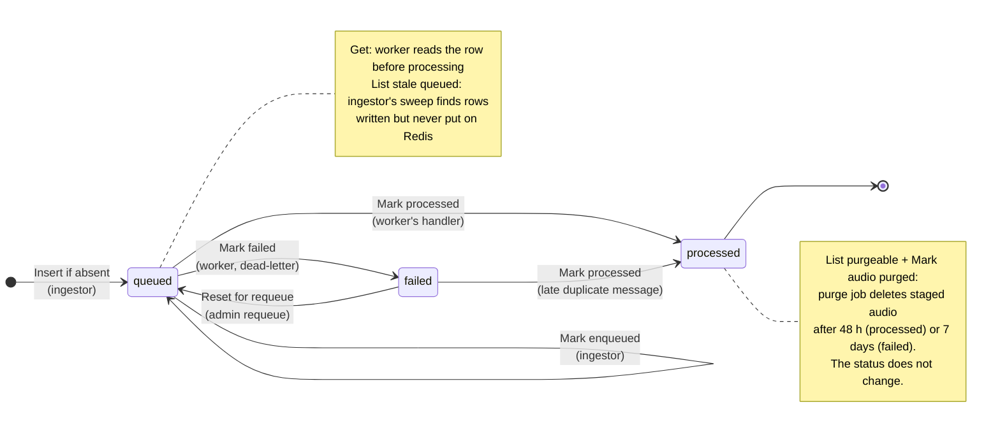

# Database schema and ledger

This document fixes the tables of the one Postgres database, their keys and constraints, the status transitions of the ledger, the ledger operations in shared code, the database roles and the migration rules. The ingestion unit writes `sources`, `source_status`, `chunks` and `feed_gaps`. The detection unit writes `detections` and updates the ledger. The foundation creates `species` empty. The search unit fills it from the Watkins species list, decides whether live detections get a species, queries all the tables and owns the vector index. The scorecard unit reads through `mobygrep_reader`.

## Conventions

- All timestamps are `timestamptz`.
- Every text "enumeration" is a text column with a named CHECK constraint, not a Postgres enum type. Enum types are awkward to change in a migration.
- Every constraint and index has a deterministic name that comes from a naming convention.
- The embedding dimension is one constant in shared code, `EMBEDDING_DIM = 1536`. Migrations hardcode the literal, because a migration is a snapshot.

## Tables

There are six tables. The column types are added to these tables when the models are built.

### `sources`

Where audio comes from.

| Column | Notes |
|---|---|
| `id` | Identity primary key |
| `slug` | Unique. Must be a valid chunk ID segment (see [chunk-id.md](chunk-id.md#format)) |
| `kind` | `live`, `archive` or `reference` |
| `name` | Display name |
| `latitude` | Optional |
| `longitude` | Optional |
| `attribution` | Optional credit and licence text |
| `config` | JSON object for source-specific settings; default empty. It lets the ingestion unit add knobs without a migration. **It never holds secrets**: the Grafana role can read this table |
| `enabled` | Default true |
| `created_at` | |
| `updated_at` | |

### `source_status`

Mutable state, one row for each source, kept apart from the static description.

| Column | Notes |
|---|---|
| `source_id` | Primary key, and foreign key to `sources` |
| `status` | `unknown`, `online` or `offline`; default `unknown` |
| `status_changed_at` | |
| `last_chunk_at` | |
| `last_checked_at` | |
| `detail` | Optional text |

### `species`

The official list of species. Every other table points here instead of storing species names as text.

#### Example rows

These rows show the shape of the table only. They are not seed data. The real rows come from the Watkins species list (see [How the list gets filled](#how-the-list-gets-filled)).

| id | code | scientific_name | common_name | rank |
|---|---|---|---|---|
| 1 | `orcinus_orca` | *Orcinus orca* | Killer whale (orca) | species |
| 2 | `megaptera_nov` | *Megaptera novaeangliae* | Humpback whale | species |
| 3 | `orca_srkw` | *Orcinus orca* (Southern Resident) | Southern Resident | ecotype |
| 4 | `unid_baleen` | — | Unidentified baleen | group |

#### Columns

| Column | Purpose |
|---|---|
| `id` | Short internal key that other tables point to |
| `code` | Stable, readable name for code, the API and URLs (`?species=orcinus_orca`). Unique. It does not change between databases, unlike `id` |
| `scientific_name` | The unambiguous name. Common names vary ("orca", "killer whale") |
| `common_name` | What people see in Grafana and search results |
| `rank` | `species`, `ecotype` or `group`: whether a row is a species, a sub-population (orca ecotypes matter for Southern Residents), or a vague group such as "unidentified baleen whale" |

An optional `parent_id` can link an ecotype to its species, so a search for orca also finds Southern Resident calls. Add it only if ecotypes are used.

#### Who points to it

| Column | Meaning |
|---|---|
| `detections.species_id` | Null in v1. The detector only tells a call from noise and never names a species. The search unit decides whether live calls get one, and how |
| `chunks.known_species_id` | The known species of reference audio, such as the Watkins library |

- `detections.species_id` is nullable, because the detector gives no species. A call is stored as "a whale call, species unknown".
- `chunks.known_species_id` is a pointer, not free text. Watkins' own names are translated to our codes when the library is loaded. An unknown name stops the load with an error, so no typo gets in.

#### How the list gets filled

- The foundation's migration creates the table with no rows.
- The search unit adds the rows from the Watkins species list, in its own migration, when it loads the library. Every row has a source.
- The list is filled on purpose, not on the fly. It ships with the code, as a reviewed data file or a migration.
- Nothing adds a species automatically because a model or a file used a new name.

#### What it gives you

- **One name per species everywhere.** "All humpback reference clips" is one join:

  ```sql
  SELECT c.*
  FROM chunks c
  JOIN species s ON s.id = c.known_species_id
  WHERE s.code = 'megaptera_nov';
  ```

  If the search unit later sets `detections.species_id`, the same join finds live calls.

- **No spelling drift.** The database refuses a species that is not in the list.
- **One place for display data**, such as names, and later images or descriptions for search results.
- **Renaming is one update.** Change the common name once and every result shows the new one.

### `chunks`

The ledger: one row for every chunk ever enqueued.

| Column | Notes |
|---|---|
| `chunk_id` | **Primary key.** The text chunk ID, declared with the `C` collation |
| `source_id` | Foreign key to `sources` |
| `group_key` | The second segment of the chunk ID, `C` collation. Kept for grouping and display. No index of its own |
| `item_key` | The third segment of the chunk ID, `C` collation. Kept for grouping and display. No index of its own |
| `started_at` | When the audio starts; null for audio with no known time |
| `duration_ms` | Optional; positive |
| `staged_audio_key` | Key of the staged audio |
| `known_species_id` | Optional foreign key to `species`: the known species of reference audio |
| `status` | `queued`, `processed` or `failed`; default `queued` |
| `trace_id` | 32 hexadecimal characters; not null |
| `created_at` | When the ledger row was written, just before the enqueue |
| `enqueued_at` | When the message was last added to its stream. Null means the row was written and the add has not succeeded (yet) |
| `settled_at` | When the chunk reached `processed` or `failed` |
| `processing_ms` | Optional |
| `model_version` | Null until processed |
| `detection_count` | Null until processed; zero means noise |
| `attempts` | The delivery count when the chunk settled |
| `consumer_name` | The consumer name of the worker that settled it |
| `error_type` | Set when failed |
| `error` | Set when failed |
| `audio_purged_at` | When the staged audio was deleted |

- The chunk ID is the primary key. An integer primary key would also need a unique index on `chunk_id` for the duplicate check, so the table would carry two indexes to identify a row. This is the table with the most rows (about 60,000 a day for seven live sources), so one identity index is better than two.
- A collation is the rule that Postgres uses to compare text. The `C` collation compares text byte by byte. It does not use the language rules of the operating system. For this reason, an update to the operating system cannot change the order of the index.
- The `C` collation also lets a prefix search use the primary key index (unconfirmed: to be proven by test). A prefix search finds all chunk IDs that start with the same text, for example all chunks of one source and folder.
- CHECK constraints: `settled_at` is set exactly when the status is `processed` or `failed`; `detection_count` is set when the status is `processed`.
- Indexes: `(source_id, started_at)`; a partial index on `created_at` for rows still `queued`; a partial index on `settled_at` for settled rows whose audio has not been purged.

### `detections`

One row for each detected call.

| Column | Notes |
|---|---|
| `id` | Identity primary key |
| `chunk_id` | Foreign key to `chunks`; the chunk in which the call starts |
| `call_index` | Position of the call in the sorted calls of its chunk, from 0 |
| `source_id` | Foreign key to `sources`; repeated here so that queries by time and source need no join |
| `start_offset_ms` | Position of the start within the chunk |
| `duration_ms` | Length of the call |
| `started_at` | Absolute start time; null when the chunk has none |
| `species_id` | Optional foreign key to `species`. Null in v1 (see [`species`](#species)) |
| `model_version` | |
| `confidence` | Optional, between 0 and 1 |
| `embedding` | The fingerprint, `vector(1536)`; not null |
| `clip_key` | Key in the clip store; optional. Only keys are stored, never URLs (see [storage.md](storage.md#clip-keys)) |
| `created_at` | |

- Unique on `(chunk_id, call_index)`. This is a backstop, not the idempotency mechanism: the handler's transaction already guarantees that the detections of a chunk come from exactly one attempt (see [idempotency.md](idempotency.md)).
- The calls of a chunk are sorted by a fixed rule before they are numbered: by start time, then species code (a null species sorts first), then end time. One window can hold calls of more than one species:

  | Detector output for `live042` | Sorted | `call_index` |
  |---|---|---|
  | window 0–5 s | orca | 0 |
  | window 0–5 s | humpback | 1 |
  | window 5–10 s | orca | 2 |

- Indexes on `started_at`, `(source_id, started_at)` and `created_at`.
- The table does not decide whether a detection is one model window or several merged windows, or whether a call may run past the end of its chunk. Those belong to the model unit and the detection unit, and the shape tolerates all of them.
- The fingerprint is a column of `detections`, not a separate table. Every detection has exactly one fingerprint, because Perch 2.0 is the only detector.
- The foundation creates no vector index. The search unit creates it in its own migration, before the table holds more than tens of thousands of rows.
- Changing the dimension later means a new migration that drops any vector index, alters the column type and recreates the index, plus the constant. With rows present, every detection must be embedded again.

### `feed_gaps`

Records the periods when we have no audio from a source.

| Column | Notes |
|---|---|
| `id` | Identity primary key |
| `source_id` | Foreign key to `sources` |
| `started_at` | Start of the gap |
| `ended_at` | Null while the gap is open. CHECK: not before `started_at` |
| `reason` | Text. The ingestion unit defines the vocabulary |
| `missing_chunks` | Optional count |
| `group_key` | Optional |
| `detail` | Optional |
| `created_at` | |

Unique on `(source_id, started_at)`.

## Idempotency keys

- The set of columns that identifies one item in a table. A unique index on these columns stops a repeated write from adding a second copy of it.

| Table | Key |
|---|---|
| `sources` | `slug` |
| `species` | `code` |
| `chunks` | `chunk_id` |
| `detections` | `(chunk_id, call_index)` |
| `feed_gaps` | `(source_id, started_at)` |

## Ledger status transitions

| Status | Meaning |
|---|---|
| `queued` | The chunk waits for a worker, or a worker is processing it |
| `processed` | A worker finished the chunk and stored its detections |
| `failed` | The chunk was moved to the dead stream. It will not be retried automatically |

| From | To | When |
|---|---|---|
| (no row) | `queued` | The ingestor enqueues the chunk. The row is written before the message goes to Redis |
| `queued` | `processed` | A worker commits the detections of the chunk |
| `queued` | `failed` | A worker dead-letters the chunk: a permanent error, or too many deliveries |
| `failed` | `queued` | A person runs `mobygrep-admin chunks requeue`. This works only while the staged audio exists |
| `failed` | `processed` | A second message for the same chunk succeeds after the first was dead-lettered. This can happen when the chunk was enqueued twice |

`processed` is final. The foundation cannot process a `processed` chunk again. To support it, the detection unit must add a reset that deletes the detections of the chunk and resets the row in one transaction. The reset works only while the staged audio exists.

## Ledger operations

The ledger operations are the shared functions that all programs must use to read or change rows in the `chunks` table. They are in the module `mobygrep.shared.db.ledger`. Each exists in a sync form for the worker and the admin command, and an async form for the ingestor.



| Operation | In plain words | Who calls it |
|---|---|---|
| Insert if absent | Create the chunk's row as `queued`, unless it already exists. Report back what is there | Ingestor, when it enqueues a chunk |
| Mark enqueued | Record that the message reached Redis (`enqueued_at`) | Ingestor |
| Get | Read a chunk's row | Worker, before it processes the chunk |
| Mark processed | Set the status to `processed`, **only if it is not already `processed`**. This stops double processing | Worker's handler |
| Mark failed | Set the status to `failed` with the error, only if it is still `queued` | Worker, when it dead-letters the chunk |
| Reset for requeue | Put a `failed` chunk back to `queued`, only if its staged audio still exists | Admin `requeue` command |
| List purgeable | Find finished chunks whose staged audio is old enough to delete | Purge job |
| Mark audio purged | Record that the staged audio was deleted | Purge job |
| List stale queued | Find rows that were written but never put on Redis (a crash between the two steps) | Ingestor's sweep |

```python
@dataclass(frozen=True)
class NewChunk:
    chunk_id: ChunkId
    staged_audio_key: str
    started_at: datetime | None
    duration_ms: int | None
    known_species_id: int | None = None


@dataclass(frozen=True)
class ChunkOutcome:
    model_version: str
    detection_count: int
    processing_ms: int
    attempts: int
    consumer_name: str
```

- `NewChunk` and `ChunkOutcome` are the two input forms the ledger operations accept. `NewChunk` holds the values that the ingestor gives to "insert if absent", and `ChunkOutcome` holds the values that a worker gives to "mark processed".

  ```mermaid
  flowchart LR
      ingestor([Ingestor]) -- NewChunk --> insert[Insert if absent]
      insert --> queued[(chunks row<br/>status: queued)]

      worker([Worker]) -- ChunkOutcome --> mark[Mark processed]
      mark --> processed[(chunks row<br/>status: processed)]
  ```

- The conditional updates are what make "processing a chunk twice changes nothing" true at the ledger. "Mark processed" locks the row, so the second of two overlapping attempts waits, then finds the row `processed` and changes nothing (unconfirmed: to be proven by test).
- **Who commits.**
  - "Insert if absent", "mark enqueued" and "mark failed" each commit their own change. The queue code calls them.
  - "Mark processed" does not commit. It runs in the transaction of the handler that processes the chunk. The handler then inserts the detections and commits once.
  - For this reason, the status and the detections of a chunk are saved together, or not at all. If a worker stops before the commit, the chunk stays queued and a retry processes it again.

## Roles

Each role is named after what it can do.

| Role | Kind | Created by | Privileges | Used by |
|---|---|---|---|---|
| `mobygrep_owner` | Login, superuser | The Postgres image (`POSTGRES_USER`) | Owns the schema. Can change tables | The `migrate` service only |
| `mobygrep_writer` | Login | The init script; password from the environment | Reads and writes rows in every table, uses sequences. No schema changes | The three programs and the admin command |
| `mobygrep_reader` | Login | The init script; password from the environment | Reads every table. Has a statement timeout and a connection limit, so a slow dashboard query cannot starve the programs | Grafana |

- Roles are created once, when the database is first initialised, by a script in `ops/postgres/initdb/`. Privileges are granted by migrations. Migrations never create or drop roles. **Obligation on the production deployment unit:** create the same three roles in its own runbook.
- The first migration grants `mobygrep_writer` and `mobygrep_reader` their privileges on all existing tables. It also sets default privileges: each table that the owner creates later gives the same privileges automatically. For this reason, a later migration does not grant privileges on its new tables. All migrations must run as `mobygrep_owner`, because default privileges apply only to tables that this role creates.

## Migration rules

- The Alembic environment and versions ship inside the package (`mobygrep/shared/db/migrations/`), so they are in the Docker image. `mobygrep-admin migrate` applies them.
- One initial migration creates the `vector` extension, all six tables (`species` with no rows) and the grants.
- Migrations always run as `mobygrep_owner`.
- **Each unit adds its own migrations on top of the foundation's.**
- **Migrations are linear, with exactly one head.** Several units add migrations in parallel from the same starting revision. Whoever merges second sets the parent of their migration to the current head before merging. CI fails if there is more than one head.

## Change log

| Date | Change | Why |
|---|---|---|
| 2026-10-02 | First draft | Written after the spike so the other units can plan against it |
| 2026-10-10 | The fallback detector is removed: no `detector` column, and the fingerprint is a column of `detections` instead of an `embeddings` table | Perch 2.0 is the only detector. During an outage, chunks wait in the queue and are processed at full quality later; an outage longer than the staging buffer ends as a recorded gap. Fallback detections would mix two qualities in one table, have no fingerprint for similarity search, and stay that way because `processed` is final |
| 2026-10-10 | New `species` table, pointed to by `detections.species_id` and `chunks.known_species_id`. The foundation creates it empty; the search unit fills it from the Watkins species list. `detections.species_id` is null in v1 | One name per species everywhere, and no spelling drift. The detector only tells a call from noise, and every row needs a source |
| 2026-10-10 | `detections` is unique on `(chunk_id, call_index)` instead of `(chunk_id, start_offset_ms)` | Future-proofing: a later model may report calls of more than one species in one window |
| 2026-10-10 | Renamed: `audio_key` to `staged_audio_key`, `label` to `known_species_id`, `completed_at` to `settled_at`, `worker` to `consumer_name`. Roles are `mobygrep_owner`, `mobygrep_writer` and `mobygrep_reader` | Names that say what the column or role holds or does |
